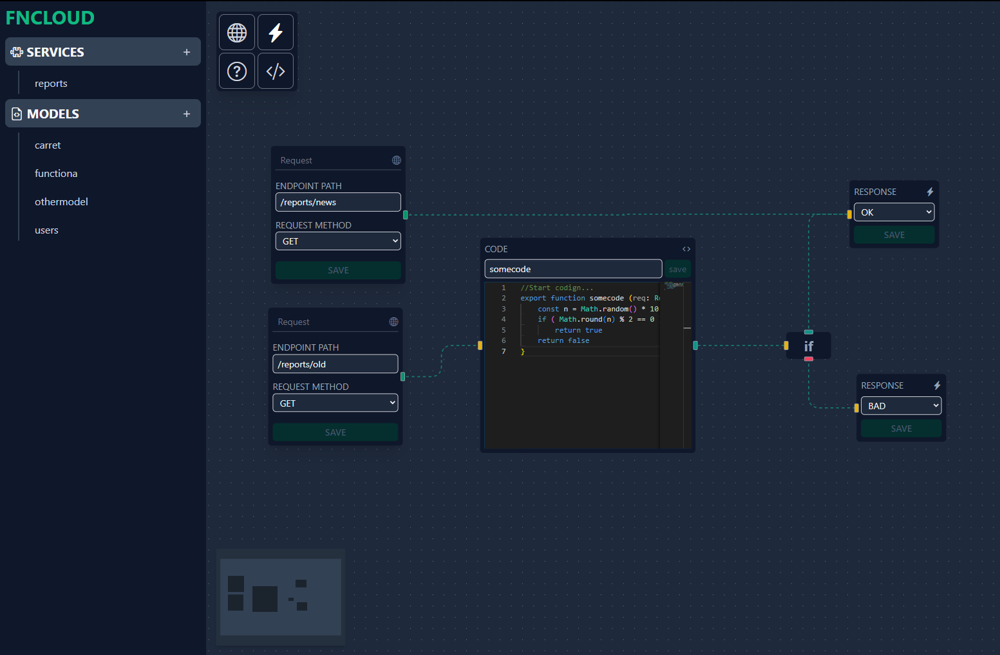
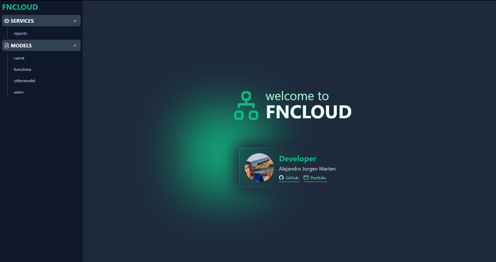

# FNCLOUD

Es una aplicación para simplificar la creación de **REST-API**, mejorar la experiencia de desarrollo en equipo y lograr una buena legibilidad a la hora de revisar código y solucionar problemas.

## TECNOLOGIAS

Construida con `electron`, `react`, `monaco-editor`, `reactflow`  y `tailwindcss` como herramientas principales, y por debajo usa `express` a la hora de compilar el proyecto para construir la **REST-API**

## CAPTURAS

